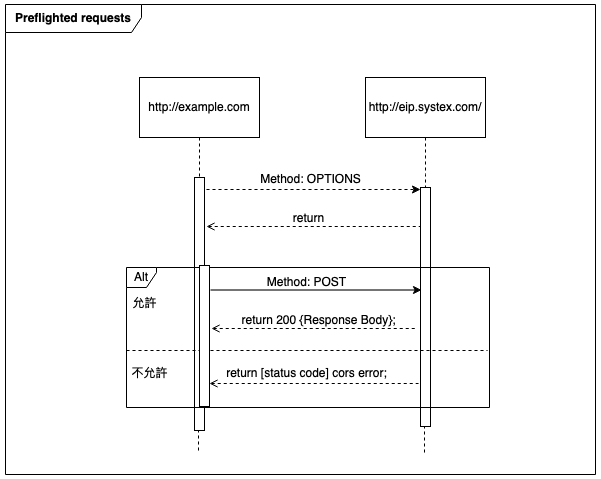
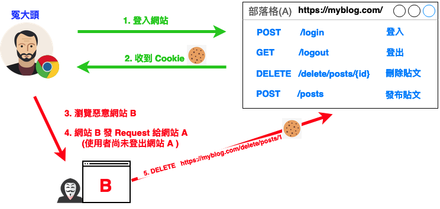
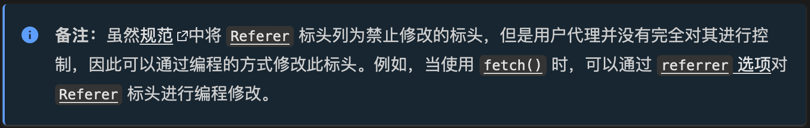

:source-highlighter: highlight.js
:highlightjs-theme: atom-one-dark-reasonable
[,javascript]

= 什麼是跨域資源共享(Cross-Origin Resource Sharing) ?

常發生在前後端分離的架構，因為前後端通常都部署在不同的 domain、sub domain、port 上，所以它們之間的請求會被視為跨域(Cross-Origin)請求，那瀏覽器就會去阻擋並回傳給前端 CORS Error，所以 CORS 就是為了解決了這一個問題。

說到 CORS 就要來談到瀏覽器的同源政策(Same-Origin-Policy), 它是一種瀏覽器的安全機制, 用來防止不明的跨來源網站對 Server 的存取。

同源必須符合三項條件:

. 同通訊協定(protocol)

. 同網域(domain)

. 同通訊埠(port)

假如現在 Server 的 URL 為: `https://api.example.com`

那來對比下面的範例看是否同源

[cols="2,1,2", options="header"]
|===
|URL |是否同源 |原因
|http://api.example.com
|N
|不同 protocol

|https://app.example.com
|N
|不同 sub domain

|http://api.example.com:5000
|N
|不同 port

|https://api.example.com/login
|Y
|
|===

==== CORS 的兩大流程: 

若未同源，瀏覽器會看 Request Method 和 Content-Type 來決定要走哪個流程

==== 一、簡單請求 (Simple Requests)

瀏覽器會直接發送請求給 Server。

那成為 Simple Request 必須具備什麼條件 ?

使用以下任一 HTTP Method：

[cols="1,2", options="header"]
|===
|Method |說明
|GET
|獲取資料

|POST
|提交資料

|HEAD
|只返回 HTTP Headers

|===

----
HTTP/1.1 200 OK
Date: Tue, 30 Jul 2024 12:34:56 GMT
Content-Type: text/html
Content-Length: 1234
Last-Modified: Tue, 30 Jul 2024 10:00:00 GMT
----

*&*

Content-Type 的值為以下任一：

ex: Content-Type 為 Http Headers 其中一個屬性, 用來描述請求和回應中的 Media Type

[cols="1,3", options="header"]
|===
|Content-Type |備註

|application/x-www-form-urlencoded
|預設表單提交

|multipart/form-data
|在表單內上傳檔案、圖片、影片

|text/plain
|純文本
|===

符合以上即為一個 Simple Request;

接下來打開 F12 來看看瀏覽器發送給 Server 的內容有哪些：

===== *Request Headers*
----
GET / HTTP/1.1
Host: api.example.com    // 請求目的地
Connection: keep-alive   // 連接方式
Accept: text/html,application/xhtml+xml,application/xml;q=0.9,image/webp,*/*;q=0.8  // Client 允許接收的內容格式
User-Agent: Mozilla/5.0 (Windows NT 10.0; Win64; x64) AppleWebKit/537.36 (KHTML, like Gecko) Chrome/103.0.0.0 Safari/537.36    // 瀏覽器、作業系統等等訊息
Accept-Encoding: gzip, deflate, br  
Accept-Language: zh-TW,en;q=0.9
Origin: http://example.com   // 比較值得注意的 Origin(請求來源端)
----

===== *Response Headers*
----
HTTP/1.1 200 OK
Content-Type: text/html; charset=UTF-8
Content-Length: 1234
Access-Control-Allow-Origin: *  // 可在後端進行設定,  * 表示所有網站都可存取
----

==== 二、預檢請求(Preflighted requests)

如沒有滿足剛剛介紹的條件, 即為預檢請求，我就直接稱作 `非簡單請求`。
像是常使用的HTTP Method `PUT`、`DELETE`、或在 HTTP Header 設定的 `Content-Type: application/json` , 這些都是非簡單請求。

===== 運作方式

與簡單請求不同的地方是, 瀏覽器會先送一次 OPTIONS Request, 確定請求是否安全, 因為接下來得請求是會對資料產生變動的，那瀏覽器就會根據後端返回的 Access-Control-Allow-Origin 判定是否允許請求，允許的話才會真正對 Server 發送真實的數據請求。

但 Preflight Request 也不是每次都會觸發，可以設定 `Access-Control-Max-Age` 預檢請求回應快取的秒數，也就是說在這秒數內可以向 Simple Request 一樣, 直接發送請求。
ex: 同源政策不擋請求只擋回應 !

參考資料:

https://developer.mozilla.org/zh-TW/docs/Web/HTTP/CORS

---

= 什麼是跨站請求偽造(CSRF) ?

簡單來說就是，被害者已在網站上登入成功，結果可能誤觸到了釣魚網頁，網頁裡面又埋了惡意的程式碼，攻擊者就可以去假冒被害者的身份對目標網站發出請求，做出刪除或是修改資源等動作。

補充: 

- 瀏覽器向 Server 發送請求時會自動帶上 Cookie(瀏覽器會看你的 Cookie 是否和目標網站同 domain，相同就會帶上)。
- JS 只能讀取和設定與當前頁面相同 domain 的 Cookie。意謂攻擊者無法獲取、修改網站上的 Cookie。

[cols="1,1", options="header"]
|===
|欄位
|說明
|Cookie
|瀏覽器存放資料的地方，可以存放 Seesion 之類的資料
|Session
|帳號登錄驗證過後，Server 端所發的識別證
|===

=== 攻擊手法

:source-highlighter: highlight.js
:highlightjs-theme: atom-one-dark-reasonable
[,html5]

ex: 請求皆使用冤大頭這個使用者的瀏覽器送出。

===== 刪除貼文範例

因為冤大頭已經登入網站並取得 Cookie，結果現在不小心誤觸了惡意網站的連結，執行了惡意程式碼(發送了刪除貼文的請求)，結果貼文就這樣被刪除了。

[source,html5]
<form 
    id="deleteForm" 
    method="DELETE" 
    action="https://myblog.com/delete/posts/1"
    style="display: none;"
>
    <input type="hidden" name="_method" value="DELETE">
</form>

===== 發布貼文範例

無緣無故就多了一則不是自己自願發的貼文。

[source,html5]
<form 
    id="postForm" 
    method="POST" 
    action="https://myblog.com/posts" 
>
    <input name='{"title":"一日機車環島" content='好累"}' type='hidden'>
    <input type="submit" value="post"/>
</form>

=== 如何防禦 ?

CSRF 攻擊之所以能夠成立，就是因為使用者已處於登入狀態。

==== 使用者防禦

- 登出

==== Server 防禦
- 簡訊驗證碼
- 檢查 Referer(不是個好作法)：

檢查 Request Headers 中的 referer，看請求過來的 domian 是否合法。
但是有風險：

    - ``可以偽造``

- CSRF Token
    * Server Side(Spring Boot)

    由 Server 端產生 Token 埋在 form 裡，然後 Server 收到請求後比對是否相同，因為偽造請求不會有這個 CSRF Token，所以可以避免造假攻擊，但是在後端需要也要存一份(Session)。

    // Thymeleaf
    <form th:action="@{/posts}" method="post">
        <!-- CSRF Token -->
        <input type="hidden" th:name="${_csrf.parameterName}" th:value="${_csrf.token}" />
        <input name='{"title":"一日機車環島" content='好累"}' type='hidden'>
        <input type="submit" value="post"/>
    </form>

- Double Submit Cookie(CSRF Token 的變形)

    核心概念：
    JS 只能讀取和設定與當前頁面相同 domain 的 Cookie。意謂攻擊者無法獲取、修改網站上的 Cookie。

    * Client Side

    前端隨機產生一個 CSRF Token，同時放進 Cookie 以及 Form 裡，Server 收到請求兩者比對，因為瀏覽器的機制，攻擊者無法將偽造的 Token 放進你 domain 的 Cookie 當中;所以跨 domain 請求所帶的 Cookie 中一定沒有正確的 CSRF Token，他也不知道 Form 裡的 Token 長怎樣。

==== Browser 防禦

以下三種屬性：

[cols="1,1", options="header"]
|===
|屬性
|說明
|Secure
|禁止在 http 上傳輸 Cookie
|Http Only
|拒絕與 JavaScript 共享 Cookie 
|SameSite
|
ex: 需注意瀏覽器及瀏覽器當前版本是否支援

本使用方式是在 Server 設定 Cookie 時，加上 SameSite，設定
    以下三種屬性：

    原本還沒設定 Same-Site 屬性時長這樣：

    範例: Set-Cookie: session_id=zxcvbn19rtyu89;

    ** *Strict **：
    
    要求最嚴格，只有 Same-Site 的情況下，才會送出 Cookie。

    範例: Set-Cookie: session_id=ewfewjf23o1; SameSite=Strict 

    ** *Lax **：
    
    比 Strict 寬鬆一點，在執行跨域請求時，只有 GET 請求， 才會一同將 Cookie 包含在這個請求中。

    範例: Set-Cookie: session_id=ewfewjf23o1; SameSite=Lax 

    ** *None **： 
    
    在執行跨域請求時，會一同將 Cookie 包含在這個請求中。
    
    範例: Set-Cookie: session_id=ewfewjf23o1; SameSite=None; Secure
    
|===

參考資料：

https://blog.techbridge.cc/2017/02/25/csrf-introduction/

https://yuchitung.github.io/2020/04/21/csrf-introduction/

https://developer.mozilla.org/zh-CN/docs/Glossary/Forbidden_header_name
